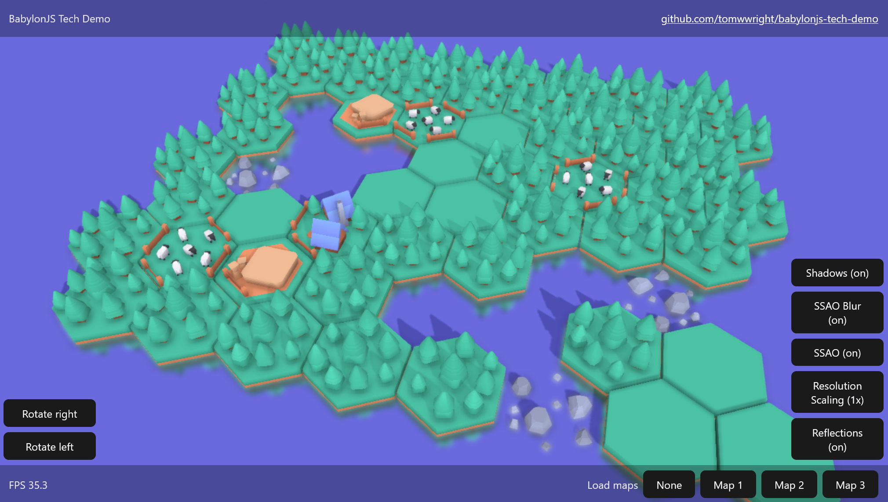

# BabylonJS + React Tech Demo

This project demonstrates a combination of [BabylonJS](https://github.com/BabylonJS/Babylon.js) for 3D rendering with [React](https://react.dev/) for UI rendering. The tech demo renders a hexagon grid with rotating and panning camera.

> [!IMPORTANT]  
> Check it out here: https://babylonjs.tomwwright.com



## Implemented features

- [Directional light](https://doc.babylonjs.com/features/featuresDeepDive/lights/lights_introduction#the-directional-light) with shadows using [cascaded shadow maps](https://doc.babylonjs.com/features/featuresDeepDive/lights/shadows_csm)
- Reflections using [mirror texture](https://doc.babylonjs.com/features/featuresDeepDive/materials/using/reflectionTexture#mirrortexture)
- [Depth of field](https://doc.babylonjs.com/features/featuresDeepDive/postProcesses/defaultRenderingPipeline#depth-of-field)
- [Screen-space ambient occlusion](https://doc.babylonjs.com/features/featuresDeepDive/postProcesses/SSAORenderPipeline) (SSAO)
- [Asset loading](https://doc.babylonjs.com/features/featuresDeepDive/importers/loadingFileTypes#how-to-use-scene-loader) from `.glb`
- Two-way integration with React using a combination of [useState](https://react.dev/reference/react/useState), [useRef](https://react.dev/reference/react/useRef), and [Observable](https://doc.babylonjs.com/features/featuresDeepDive/events/observables)
  - Buttons can send events that can be responded to by BabylonJS, and vice-versa
  - BabylonJS can modify state used by React render via React `useState` hooks that are exposed
  - BabylonJS cleans up on dismount

## Integration with React

BabylonJS is initialised within React component tree and provided with [useContext](https://react.dev/reference/react/useContext). _See [`BabylonJsProvider`](./src/BabylonJsProvider.tsx)_

The bulk of the BabylonJS rendering setup is then configured further down the component tree. _See [`SceneManager`](./src/SceneManager.ts) and [`SceneRendering`](./src/babylonjs/SceneRendering.ts)_

Handling of assets and the hex grid is maintained in their own classes and exposed via the scene manager. _See [`HexagonGridController`](./src/babylonjs/HexagonGridController.ts) and [`MapLoader`](./src/babylonjs/MapLoader.ts)_

React elements can interact with BabylonJS via React state. _See [`SceneManager` exposed via `setState`](./src/SceneManager.ts) and [accessed by `LoadMapButton`](./src/components/LoadMapButton.tsx) to trigger map loading_

Communication between React and BabylonJS is also facilitated by events. _See [`CameraController` listens to `onMapLoaded` and `rotateCamera` events](./src/babylonjs/CameraController.ts) and [`FpsCounter` listens to `onRenderStats` events to display FPS](./src/components/FpsCounter.tsx)_

## Assets by Kenney

Thanks to [kenney.nl](https://kenney.nl/) for great assets to be able to develop with.

## Installing and running

Install dependencies with `pnpm`

```sh
pnpm install
```

Run local development server

```
pnpm dev
```

Linting using `prettier` and `eslint`

```
pnpm lint
pnpm lint:fix
```
